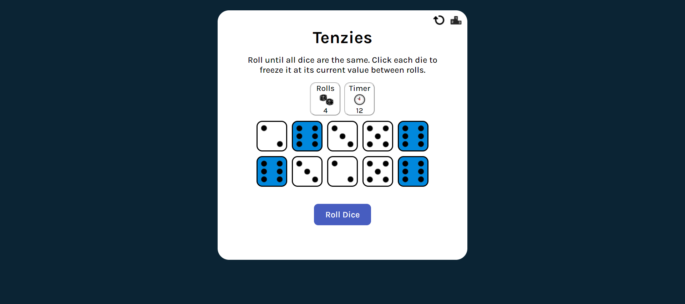
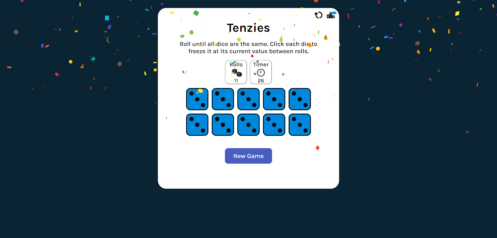
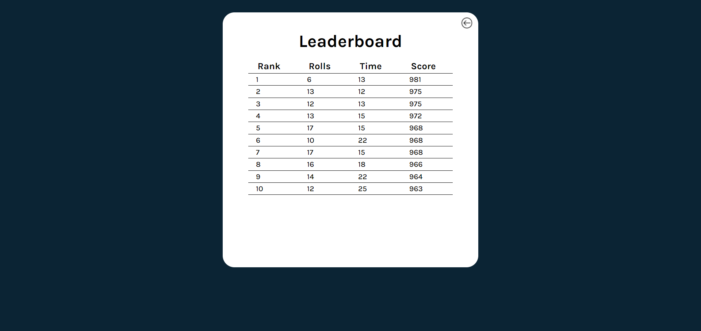

# Tenzies - Dice Board Game
Tenzies is a simple board game where the only way to win is to roll the dice until all of them are same.

## Rules:
1) Click on dices that you do not want to roll.
2) Click on Roll button to roll all the other dices.
3) Keep repeating step 1 and 2 until all are same.
4) Try to achieve this in as low of a time and rolls as possible.
5) Enjoy :D

## Live Link:
https://wonderful-raman-f7fb8e.netlify.app/

## Screenshots:
### Main Game 

### Victory Screen

### Leaderboard

## Available Scripts:

In the project directory, you can run:

### `npm start`

Runs the app in the development mode.
Open [http://localhost:3000] to view it in your browser.

